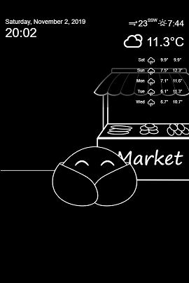

 

  

  

Bubble-life is a customizable and interactive interface. The app revolves around the life of your Bubble. This will make its life and will interact with the installed modules.

# Documentation
The complete documentation (including installation and configuration) is available via this link [https://github.com/Achaak/bubble-life.wiki.git](https://github.com/Achaak/bubble-life.wiki.git)
- [Installation](https://github.com/Achaak/bubble-life/wiki/Installation)
- [Configuration](https://github.com/Achaak/bubble-life/wiki/Configuration)
- [Modules](https://github.com/Achaak/bubble-life/wiki/Modules)
